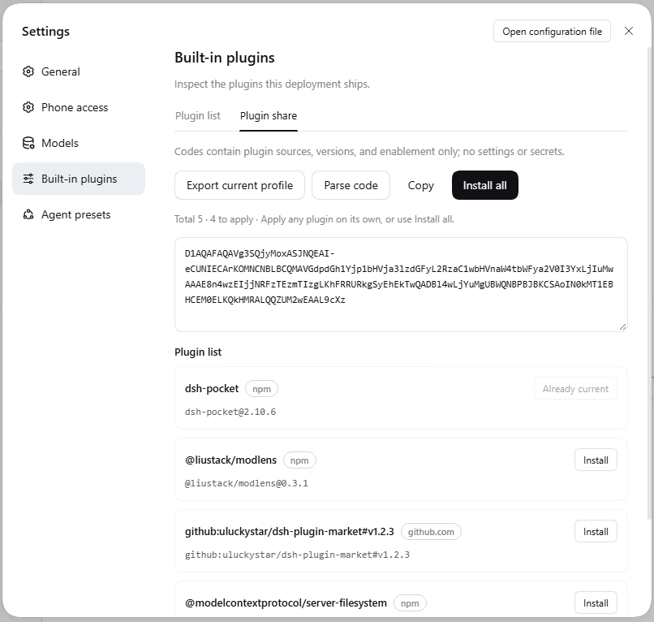

<p align="center">
  
</p>

# DSH Plugin Share

English | [中文](README.md)

Turn "which plugins I have installed" into a pasteable **offline share code** — whoever receives it can **install them one plugin at a time**.

[](https://github.com/HGT158/dsh-plugin-share)
[](https://github.com/HGT158/dsh-plugin-share/tags)
[](https://deepseek-harness.github.io/deepseek-harness/develop/basic/publish)



## Install

```powershell
dsh plugin --profile web add 'github:HGT158/dsh-plugin-share#main'
dsh --profile web
```

Open Harness Web → **Settings → Built-in plugins → Plugin share**.

The package is plain JS with zero dependencies and no build step, so the install **never asks you to approve a build script**. Both sides need it — the code is just text; this plugin is the interface that exports and pastes it.

Verified on `dsh 0.2.0-rc.2` with the Web profile (`@deepseek-ai/dsh-base` / `@deepseek-ai/dsh-web-app`). The desktop profile is managed by the desktop app itself and cannot be installed into from the CLI.

## How to use it

**① Export — turn your set into a code**

Click **Export current profile** → the box fills with a code starting with `D1` → click **Copy** and send it.

**② Import — install someone else's code on this machine**

Paste the code and click **Parse code**. Every plugin is listed with its name, source, full install spec, and the action it would take. Each row has its own button:

| Button | Meaning |
|---|---|
| `Install` | Not present locally → install it |
| `Upgrade` | Older version installed → move to the version in the code |
| `Enable` / `Disable` | Installed but the enablement differs → change state only, no reinstall |
| `Already current` | Nothing to do (greyed out) |

**Install all** at the top applies every pending row at once. Restart dsh afterwards, and press Ctrl+F5 in the browser.

## What it does

- **Offline and self-contained** — no server, account, or landing page. A code is text: send it over WeChat, Slack, a forum, or paste it into an issue. It starts with `D1`, carries NP1-style binary records, and ends with a CRC32.
- **The list only, never the configuration** — a code holds three things: plugin source, version, and enablement. `config`, `settings`, `patch`, `apiKey`, `token` and friends are rejected at encode time, so there is no "filter it and export anyway" path.
- **Preview before anything happens** — parsing only decodes and validates; it never touches the profile. What would be installed, where it comes from (`npm` / `github.com` / `builtin`), and what each row would do is all laid out first.
- **Per-plugin actions** — one button per row. Install two of them, or all of them. A single-row install re-parses afterwards so that row's state refreshes.
- **Build scripts denied by default** — a package that needs an install script stops the import and asks you explicitly; the approval covers that one run and never travels with the code.
- **Stop on failure, roll back** — a failure stops the run instead of continuing; bundles installed by that run are removed and builtin enablement changed by it is restored. Existing upgrades are not destructively rolled back.
- **Every disabled button explains itself** — a line under the toolbar says what is missing (no code pasted, not parsed yet, code changed, working) and how many rows are pending.
- **Short codes first** — short lists stay raw binary; eight or more entries try `deflate-raw`, and only when it actually comes out shorter. A mixed 5-plugin sample is 218 characters, an npm/builtin-only list of 5 is 149 — both fit in WeChat, Slack, or X.
- **Native DSH look** — controls come from the official `@deepseek-ai/dsh-client-ui-primitives` (`Button`, `Tag`) and colors from `--dsw-*` theme tokens, matching the rest of the settings surface.
- **Fully local** — encoding, decoding, and validation all happen on your machine with no third-party service involved. The network is touched only when you click install, and only to reach npm or GitHub.

## Updating

The lockfile pins `#main` to a specific commit, so updating is explicit:

```powershell
dsh plugin --profile web update dsh-plugin-share
dsh --profile web
```

To pin a version instead (reproducible installs), use the tag:

```powershell
dsh plugin --profile web add 'github:HGT158/dsh-plugin-share#v0.1.0'
```

## Security

- **A code is not a signature** — the CRC32 only catches copy or truncation damage. It **does not** prove authenticity and cannot stop tampering. Check every source in the preview before installing.
- **Source allowlist** — only npm packages, `github:owner/repo[#ref]`, and official optional DSH builtin bundles. Local paths, `file:`, `link:`, `portal:`, `workspace:`, arbitrary HTTP(S) tarballs, and `git+…` / `git@` / `ssh://` remotes are all refused.
- **Sources stay visible** — every row names its source (`npm` / `github.com` / `builtin`) and shows the full install spec such as `github:owner/repo#v1.2.3`, so you can confirm it is the repository you expect.
- **No scripts by default** — a package that needs one interrupts the import and asks; the approval is per-run and per-package, and is never forwarded to the next person.
- **Ask yourself before installing** — did this code come from someone you trust, and do the names and repositories in the preview look familiar? Third-party plugins can run code when they install or load.

## FAQ

**Does the receiving side need this plugin too?**
Yes. A code is just text; this plugin provides the import UI. If they would rather not install it, they can clone the repo and decode from the CLI: `node src/cli.mjs decode D1...`.

**Will it leak my API keys or configuration?**
No. A code has no configuration fields; the encoder rejects `config`, `apiKey`, `token` and similar outright, and local paths are dropped during collection.

**Nothing happened after installing. Why?**
Host-side changes need a dsh restart. The client bundle is cached by revision, so press Ctrl+F5 in the browser.

**Why is a button greyed out?**
The grey line under the toolbar states the reason: no code pasted yet, not parsed yet, the code changed and needs re-parsing, or a request is in flight.

**Can it share plugin configuration?**
No, and that is deliberate in v1: it carries *which plugins*, not *how they are configured*. The receiving side starts with defaults and configures each plugin itself.

**How long is a code?**
A mixed 5-plugin sample measured 218 characters; five npm/builtin-only entries measured 149. Compression is considered from eight entries up. Very long package names or very many entries can still exceed some channel limits.

## Development

```powershell
npm test                        # codec + collector + import transaction, 20 tests
pnpm pack --dry-run             # inspect what would be published
npm run encode:example          # build a code from examples/plugins.json
node src/cli.mjs decode D1...   # decode from the command line
```

Install the working tree into a throwaway profile:

```powershell
$profile = 'plugin-share-test'
dsh --profile $profile --from-default-profile web --dump-config
dsh plugin --profile $profile add (Get-Location).Path
dsh --profile $profile
```

| File | Role |
|---|---|
| `package.json` | DSH bundle manifest: `dsh.bundle.patch` + `dsh.client` |
| `cordis.patch.yml` | The one patch row that inserts this plugin |
| `src/index.mjs` | Host half entry (codec, collector, preview, import) |
| `src/client.js` | Web client half (the settings tab) |
| `src/shared/` | D1/NP1 codec and entry validation |
| `src/host/` | Collector, preview, transactional import, HTTP routes |
| [`PLAN.md`](PLAN.md) | The full implementation contract: frame format, field model, transaction semantics, verification checklist |

CI runs `npm test` and `pnpm pack --dry-run` on every push and pull request.

## Related

- [DSH docs: packaging and installing plugins](https://deepseek-harness.github.io/deepseek-harness/en/develop/basic/publish) — the official bundle / profile / patch layer model
- [dsh-market](https://github.com/dsh-market/dsh-market) — the community plugin market; this plugin's settings UI follows its layout conventions

## License

MIT
