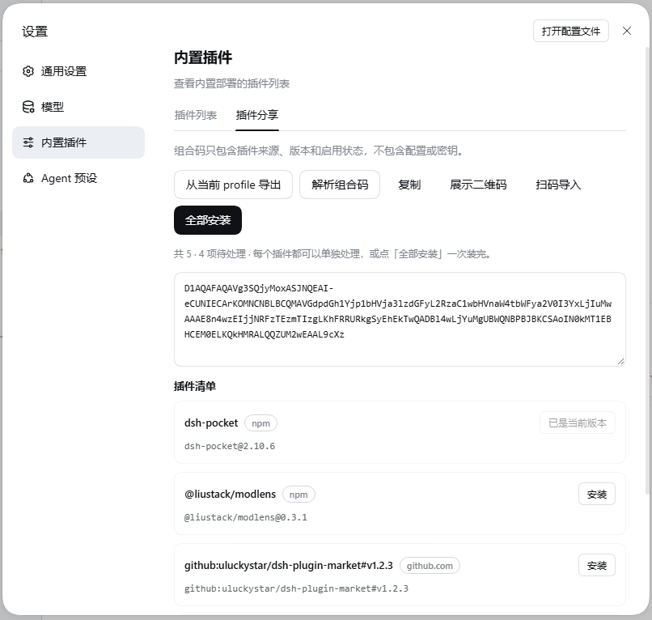
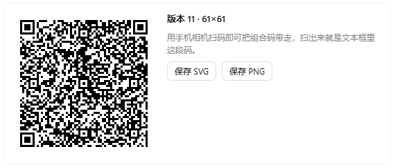

<p align="center">
  
</p>

# DSH Plugin Share

[English](README.en.md) | 中文

把「我这套装了哪些插件」变成一段可粘贴的**离线分享码**，别人贴进去就能**逐个安装**。

[](https://github.com/HGT158/dsh-plugin-share)
[](https://github.com/HGT158/dsh-plugin-share/tags)
[](https://deepseek-harness.github.io/deepseek-harness/develop/basic/publish)



## 安装

```powershell
dsh plugin --profile web add 'github:HGT158/dsh-plugin-share#main'
dsh --profile web
```

打开 Harness Web → **设置 → 内置插件 → 插件分享**。

这个包是纯 JS、零依赖、没有构建脚本，所以安装时**不会要求你批准任何 build script**，装完即用。分享方和接收方都需要装它——码本身只是文本，导出和粘贴导入的界面由它提供。

已验证环境：`dsh 0.2.0-rc.2` + Web profile（`@deepseek-ai/dsh-base` / `@deepseek-ai/dsh-web-app`）。桌面 profile 由桌面 App 自行管理，CLI 装不进去。

## 怎么用

**① 导出：把你这套插件变成码**

点「从当前 profile 导出」→ 文本框出现 `D1...` 开头的码 → 点「复制」，发给对方。

也可以点「展示二维码」，把当前这段码画成手机可扫的二维码（再点一次「收起二维码」收起）；面板里显示版本与尺寸，可点「保存 SVG」（矢量，放大不糊）或「保存 PNG」（位图，聊天工具里到处都能预览）。



**② 导入：把别人的码装到本机**

把码粘进文本框，点「解析组合码」，下面会逐行列出每个插件的名称、来源、完整安装规格和将要执行的动作。每一行右侧都有自己的按钮：

| 按钮 | 含义 |
|---|---|
| `安装` | 本机没有 → 安装 |
| `升级` | 已装旧版本 → 升到码里的版本 |
| `启用` / `停用` | 已装但启用状态不一致 → 只改状态，不重装 |
| `已是当前版本` | 无需操作（灰色不可点） |

**不想手打码也行**：点「扫码导入」选一张二维码图片，或者把图片直接**拖进面板**——识别出来的码会自动填进文本框并立刻解析。适合别人把二维码截图发给你、或你先存成图片的场景。

也可以点顶部「全部安装」一次装完；装完**重启 dsh** 生效，浏览器按 Ctrl+F5。

## 它能做什么

- **离线自包含的码** — 不需要服务器、账号或落地页。码就是文本，能发微信、Slack、论坛、贴进 issue。组合码以 `D1` 开头，内部是 NP1 风格的二进制记录，末尾带 CRC32。
- **只带清单，不带配置** — 码里只有三样：插件来源、版本、启用状态。`config`、`settings`、`patch`、`apiKey`、`token` 等字段在编码阶段就被拒绝，不存在「过滤后继续导出」的路径。
- **逐条预览，绝不静默安装** — 解析只做解码和校验，不碰 profile；要装什么、从哪来（`npm` / `github.com` / `builtin`）、会做什么动作，全部先摆出来给你看。
- **每个插件单独操作** — 一行一个按钮。可以只装其中两个，也可以全部安装；单个装完会自动重新解析，刷新那一行的状态。
- **构建脚本默认拒绝** — 需要跑安装脚本的包会单独提示并等你显式批准，批准只对本次生效，不随码传播。
- **失败即停并回滚** — 中途失败不会继续往下装，本次新装的会被撤销，本次改过的 builtin 启用状态会被恢复；已存在的升级不会被破坏性回滚。
- **状态永远有解释** — 按钮为什么灰、现在在做什么、解析出来几条待处理，界面上一行文字直说，不会让你对着一个没有理由的禁用按钮发呆。
- **短码优先** — 短清单直接用原始二进制；8 条以上才尝试 `deflate-raw`，且只在压缩结果更短时才采用。实测 5 个插件的混合样本（含 GitHub 来源）是 218 个字符，纯 npm / builtin 的清单更短（149 字符），微信、Slack、X 都能直接发。
- **二维码导出** — 点「展示二维码」把当前码画成黑白二维码，手机相机直接扫走；自动选最小版本、M 级纠错，放不下时降到 L，还放不下会明确提示改用文本。「保存 SVG」存矢量（打印/嵌入），「保存 PNG」存位图（发聊天工具最保险）。
- **扫码导入** — 选图或拖图都能识别，认出码就自动填进文本框并解析。识别完全在本机做，图片不上传；解出来的内容还要通过组合码的 CRC32 校验才会被采用，读错一个字都会明确报「识别失败」而不是塞进一个坏码。
- **DSH 原生外观** — 控件用官方 `@deepseek-ai/dsh-client-ui-primitives` 的 `Button` / `Tag`，配色走 `--dsw-*` 主题 token，跟设置里其它页面同一套视觉。
- **完全离线** — 编码、解码、校验、连二维码生成都在本机完成，不访问任何第三方服务；只有你点安装时才会去 npm / GitHub 下载插件。

## 更新到最新版

锁文件会把 `#main` 钉在某个具体提交上，所以升级要显式执行：

```powershell
dsh plugin --profile web update dsh-plugin-share
dsh --profile web
```

想固定版本（可复现），改用 tag：

```powershell
dsh plugin --profile web add 'github:HGT158/dsh-plugin-share#v0.2.0'
```

## 安全

- **每个接口都先过 DSH 的信任闸** — 分享接口的请求一律先问组合的 `connection` 服务（`requestRejection`）：Host/Origin 校验挡掉 DNS rebinding 与跨站调用，浏览器鉴权校验登录 token。没有凭据的本机进程或网页只会拿到 401——读不到你的插件清单，更碰不到安装那条路；这道检查在读请求体之前执行。
- **码不是签名** — CRC32 只用来发现复制/截断造成的损坏，**不能防篡改**，也不证明来源。请核对预览里的每个来源再装。
- **来源白名单** — 只接受 npm 包、`github:owner/repo[#ref]`、DSH 官方可选 builtin。本地路径、`file:`、`link:`、`portal:`、`workspace:`、任意 HTTP(S) tarball、`git+…` / `git@` / `ssh://` 一律拒绝。
- **来源全程可见** — 每行都标明来源（`npm` / `github.com` / `builtin`）并列出完整安装规格（如 `github:owner/repo#v1.2.3`），GitHub 来源显示域名，方便你确认是不是官方仓库。
- **默认不执行脚本** — 需要构建脚本的包会中断安装并单独询问；批准只对本次、本包生效，不会随码传播给下一个人。
- **安装前请自问** — 码是你信任的人给的吗？预览里的包名和仓库眼熟吗？第三方插件在安装或加载时都能执行代码。

## 常见问题

**接收方也要装这个插件吗？**
要。码只是文本，导入界面由插件提供。如果对方不想装，也可以把仓库 clone 下来用命令行解码：`node src/cli.mjs decode D1...`。

**会不会把我的 API key / 配置发出去？**
不会。码里没有配置字段，编码器遇到 `config`、`apiKey`、`token` 这类字段直接报错；本机路径也在采集阶段就被剔除。

**为什么装完没反应？**
Host 半的改动要重启 dsh 生效；客户端 bundle 有版本缓存，浏览器按 Ctrl+F5 强制刷新。

**为什么按钮是灰的？**
按钮下面那行灰字会直接说明原因：还没粘贴码 / 还没解析 / 码改动过需要重新解析 / 正在处理中。

**能分享插件配置吗？**
不能，这是 v1 的有意选择：只搬「装了哪些」，不搬「怎么配的」。接收方装完是素装，各插件设置要自己配。

**码会有多长？**
实测 5 个插件的混合样本 218 字符，纯 npm / builtin 的 5 条清单 149 字符；8 条以上才会考虑压缩。插件名极长或条目极多时仍可能超过某些渠道限制。

**二维码扫不出来？**
用手机相机或扫码 App 直接对着屏幕扫，别先拍照再识别。面板上会写出版本号：57×57（版本 10，约 180 字符）在手机屏上很稳；版本 20 以上已经很密，这种情况直接发文本更靠谱。

**「扫码导入」认不出图片？**
它针对的是**正对、干净的二维码图片**——本插件保存的 PNG/SVG、别人发来的二维码截图、屏幕上截的图，这些都很准（整屏截图里只有一小块二维码也能认出来）。**斜着拍的照片、模糊或残缺的图片不在支持范围**，这时会明确告诉你「没找到二维码」或「识别失败」，不会瞎猜。

## 开发

```powershell
npm test                        # 编解码 + 采集 + 导入事务 + 二维码 + 扫码 + 路由鉴权，共 35 项
pnpm pack --dry-run             # 检查发布内容
npm run encode:example          # 用 examples/plugins.json 生成一个码
node src/cli.mjs decode D1...   # 命令行解码
```

把本地工作树装进一个临时 profile：

```powershell
$profile = 'plugin-share-test'
dsh --profile $profile --from-default-profile web --dump-config
dsh plugin --profile $profile add (Get-Location).Path
dsh --profile $profile
```

| 文件 | 作用 |
|---|---|
| `package.json` | DSH bundle 清单：`dsh.bundle.patch` + `dsh.client` |
| `cordis.patch.yml` | 插入本插件的那一行 patch |
| `src/index.mjs` | Host 半入口（编解码、采集、预览、导入） |
| `src/client.js` | Web Client 半（设置页里的标签页） |
| `src/shared/` | D1/NP1 编解码与条目校验 |
| `src/host/` | 采集、预览、事务导入、HTTP 路由 |
| [`PLAN.md`](PLAN.md) | 完整实现契约：帧格式、字段模型、事务语义、验证清单 |

CI 在每次 push / PR 时运行 `npm test` 与 `pnpm pack --dry-run`。

## 相关

- [DSH 官方：打包与安装插件](https://deepseek-harness.github.io/deepseek-harness/develop/basic/publish) — bundle / profile / patch 层的官方说明
- [dsh-market](https://github.com/dsh-market/dsh-market) — 生态里的插件市场，本插件的界面风格参考了它

## License

MIT
